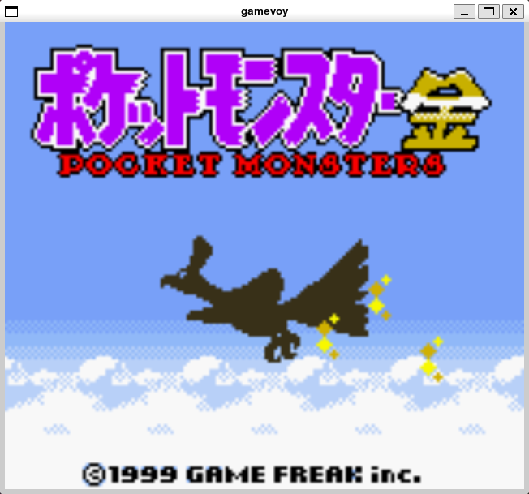

# gamevoy
game boy color emulator in V

# control
- arrow keys: arrow keys
- z: A
- x: B
- c: Start
- v: Select
- enter: save manually
- esc: exit

# features
- Cartridge
  - [x] No MBC
  - [x] MBC 1
  - [x] MBC 3
    - [x] RTC
  - [x] MBC 30
  - [x] MBC 5
  - [ ] Others
- PPU
  - [x] DMG
  - [x] DMG compat mode
  - [x] CGB
- Save support

# passing tests
- Blargg's test roms
  - [x] cpu_instrs
  - [x] instr_timing
  - [x] mem_timing
  - [x] mem_timing-2
  - [x] interrupt_timing
- acid2
  - [x] dmg-acid2
  - [x] cgb-acid2
- Mooneye Test Suite
  - [x] acceptance/timer

# reference
[The V Programming Language](https://github.com/vlang/v)

[Rustで作るGAMEBOYエミュレータ](https://techbookfest.org/product/sBn8hcABDYBMeZxGvpWapf)

[Pan Docs](https://gbdev.io/pandocs/)

[gb-docs-ja](https://github.com/akatsuki105/gb-docs-ja)
